# How I Automated IP Address Management in AWS Using Terraform

# Contents

- [How I Automated IP Address Management in AWS Using Terraform](#how-i-automated-ip-address-management-in-aws-using-terraform)
- [Why I Needed IPAM for My AWS Workloads](#why-i-needed-ipam-for-my-aws-workloads)
  - [How IPAM Solved My Problems](#how-ipam-solved-my-problems)
- [IPAM Overview: The Building Blocks](#ipam-overview-the-building-blocks)
- [How I Did It: Using Terraform](#how-i-did-it-using-terraform)
  - [Why Terraform and VSCode?](#why-terraform-and-vscode)
  - [Implement IPAM](#implement-ipam)
- [Creating a VPC Using the AWS Provider](#creating-a-vpc-using-the-aws-provider)
- [Creating a VPC in Another Region Using the AWS Provider](#creating-a-vpc-in-another-region-using-the-aws-provider)
- [Shared Tags - Provider Differences](#shared-tags---provider-differences)
- [IPAM Resource Deletion Safety Mechanism](#ipam-resource-deletion-safety-mechanism)
  - [Bypassing the Safety Mechanism](#bypassing-the-safety-mechanism)
- [Deleting IPAM Resources](#deleting-ipam-resources)
  - [Destroying the Remaining Resources](#destroying-the-remaining-resources)
- [Conclusion](#conclusion)

---

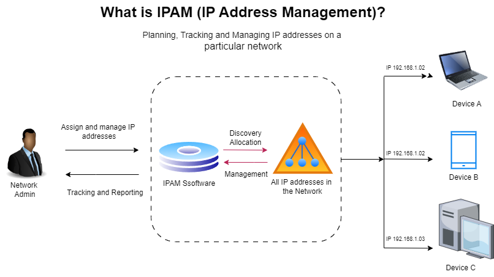

Managing IP addresses efficiently can feel like herding cats, especially when working with complex AWS environments. That’s where Amazon VPC IP Address Manager (IPAM) comes to the rescue and why I’m excited to share how I implemented it using Terraform. This hands on guide will walk you through the steps I took to automate and simplify IP address management in AWS. 


## Why I Needed IPAM for My AWS Workloads

Picture this: I was working on a project with multiple VPCs spanning different AWS regions, and keeping track of all those IP addresses manually was a nightmare. The risk of IP conflicts was high, and the time spent double-checking everything added unnecessary stress. That’s when I decided to explore **Amazon VPC IPAM, a tool designed to streamline IP address planning, tracking, and monitoring.** 
By integrating it with Terraform, I was able to make the entire process more predictable and manageable. Setting up IPAM wasn’t just about getting organized, it was **about gaining visibility and control over IP usage across all my AWS workloads.** And trust me, the difference it made was substantial.


### How IPAM Solved My Problems

Implementing IPAM transformed how I approached network management in AWS. Instead of dealing with scattered spreadsheets and the constant fear of overlapping IP addresses, I had a centralized solution. This not only saved me hours of work but also reduced errors and provided a clear overview of IP utilization. If you’re dealing with complex AWS environments, mastering IPAM can bring the same clarity and efficiency to your workflows.

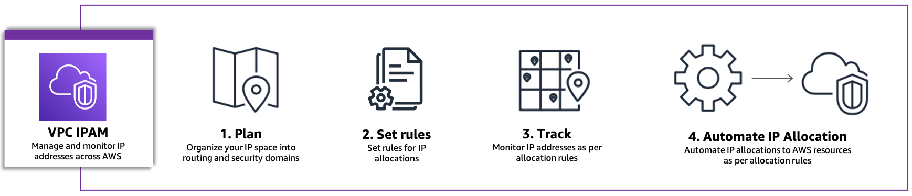

## IPAM Overview: The Building Blocks

To simplify the implementation, I broke down the architecture into individual components. Here's how I tackled it:

1. **Deploy IPAM**: The starting point of the setup, where we establish the IPAM framework.
2. **Deploy IPAM Root Pool**: This is the foundation that houses the primary range of IP addresses.
3. **Deploy IPAM Child Pools**: These pools are configured to segment IP addresses for different purposes, such as specific AWS regions or workloads.
4. **Deploy a VPC in the `us-east-1` Region**: The first VPC setup, using IP addresses allocated from our child pool.
5. **Deploy a VPC in the `us-east-2` Region**: The second VPC setup, ensuring that resources in different regions are well-coordinated and organized.


## How I Did It: Using Terraform

I decided to use Terraform for its Infrastructure as Code (IaC) capabilities, which made the deployment process efficient and repeatable. By writing Terraform scripts, I could automate the creation and configuration of IPAM and the associated resources. I also used Visual Studio Code (VSCode) locally, but you could also leverage AWS Cloud9, a cloud-based integrated development environment (IDE), to manage and execute Terraform code seamlessly.


### Why Terraform and Vscode?

1. **Terraform**: It allowed me to define the IPAM configuration declaratively, ensuring that every deployment was consistent.
2. **VSCode / AWS Cloud9**: Provided a collaborative coding environment where I could write, debug, and deploy my Terraform scripts directly, both locally and in the cloud.


## Implement IPAM

1. Verify that Terraform is installed. If it is installed, it will display the version.

```bash
terraform --version
```

2. Run `touch providers.tf` and add awscc provider configurations to the file.

```bash
terraform {
  required_providers {
    awscc = {
      source = "hashicorp/awscc"
      version = " >= 1.18.0"
    }
  }
}

provider "awscc" {
  region = "us-east-1"
}
```
3. Run `touch main.tf`
 - We need to create the IPAM resource with operating regions in us-east-1 and us-east-2.
 - Add the `awscc_ec2_vpc` Resource configuration in main.tf.
 [The awscc provider documentation](https://registry.terraform.io/providers/hashicorp/awscc/latest/docs)
 
 ```bash
resource "awscc_ec2_ipam" "main" {
  operating_regions = [
    {
      region_name = "us-east-1"
    },
    {
      region_name = "us-east-2"
    }
  ]
  tags = [{
    key   = "Name"
    value = "global-ipam"
  }]
}
 ```
 - Run `terraform apply` 

<div>
    
</div>

- Review the configuration and resource created in the `IPAM console.`

<div>
    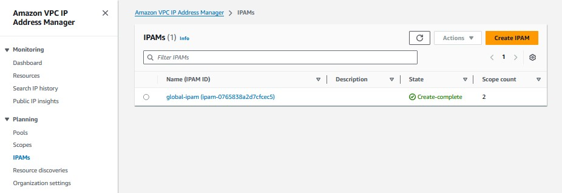
</div>

4. Create the Root IPAM Pool using the [`awscc_ec2_ipam_pool resource`](https://registry.terraform.io/providers/hashicorp/awscc/latest/docs/resources/ec2_ipam_pool)

```bash
resource "awscc_ec2_ipam_pool" "root" {
  address_family = "ipv4"
  ipam_scope_id  = awscc_ec2_ipam.main.private_default_scope_id
  auto_import    = false

  provisioned_cidrs = [
    {
      cidr = "10.0.0.0/16"
    }
  ]

  tags = [{
    key   = "Name"
    value = "top-level-pool"
  }]
}

```

5. Apply the above changes `terraform apply`

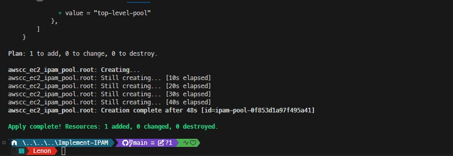

- check the [console](https://us-east-1.console.aws.amazon.com/ipam/home?region=us-east-1#Pools)

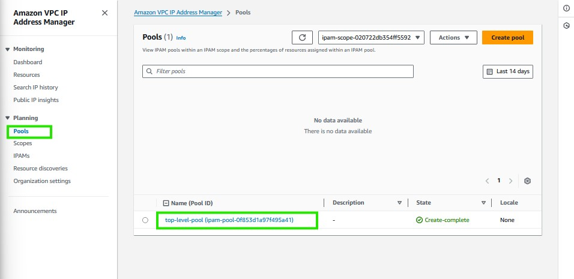


6. Provisioning 2 Child IPAM Pools: One pool will handle CIDRs for `us-east-1`, and the other for `us-east-2`

- **manages the us-east-1 region**

    ```
    resource "awscc_ec2_ipam_pool" "useast1" {
    address_family      = "ipv4"
    auto_import         = false
    ipam_scope_id       = awscc_ec2_ipam.main.private_default_scope_id
    locale              = "us-east-1"
    source_ipam_pool_id = awscc_ec2_ipam_pool.root.ipam_pool_id

    provisioned_cidrs = [
        {
        cidr = "10.0.0.0/17"
        }
    ]

    tags = [{
        key   = "Name"
        value = "regional-pool-us-east-1"
    }]
    }

    ```

 - **manages the us-east-2 region**

```
    resource "awscc_ec2_ipam_pool" "useast2" {
    address_family      = "ipv4"
    auto_import         = false
    ipam_scope_id       = awscc_ec2_ipam.main.private_default_scope_id
    locale              = "us-east-2"
    source_ipam_pool_id = awscc_ec2_ipam_pool.root.ipam_pool_id

    provisioned_cidrs = [
        {
        cidr = "10.0.128.0/17"
        }
    ]

    tags = [{
        key   = "Name"
        value = "regional-pool-us-east-2"
    }]
    }
```

7. Apply the above changes `terraform apply`

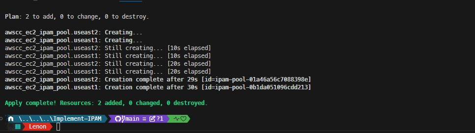

- check the [console](https://us-east-1.console.aws.amazon.com/ipam/home?region=us-east-1#Pools)

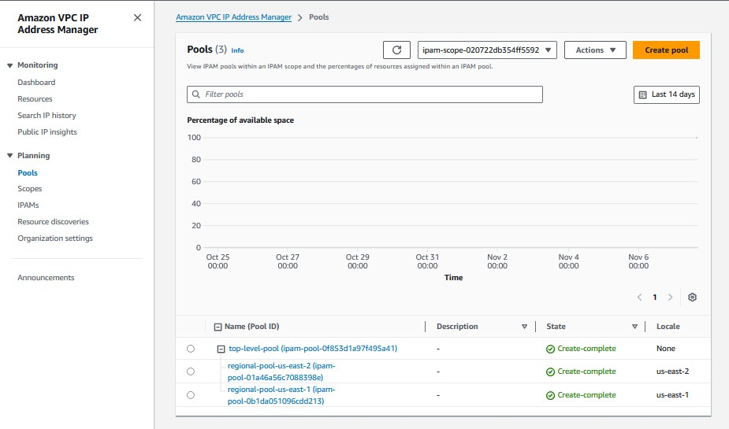

## Using multiple providers

In the previous Steps, we leveraged the `awscc provider` to set up our IPAM resources. Now, we'll switch to the `aws provider` to create our VPCs. Each VPC will automatically pull its CIDR allocation from the IPAM pool assigned to its specific region.

## Setting Up the AWS Provider in Terraform

In this section, we'll be initializing the `aws` provider, which will handle the creation of our VPC resources. Here's what we'll be doing:

### Goal
- Set up the Terraform `aws` provider and configure it with local state.

### Steps to Initialize the AWS Provider

1. **Open `providers.tf`**.
2. **Replace the Contents**: Update the `providers.tf` file that we previously configured for the `awscc` provider. Replace the existing contents with the following configuration:

   ```hcl
   terraform {
     required_providers {
       aws = {
         source = "hashicorp/aws"
       }
       awscc = {
         source = "hashicorp/awscc"
       }
     }
   }

   provider "aws" {
     region = "us-east-1"
   }

   provider "awscc" {
     region = "us-east-1"
   }

### Initialize Terraform

Next, we'll use the Terraform CLI to initialize the providers. This step will download and install the aws and awscc providers that we defined.

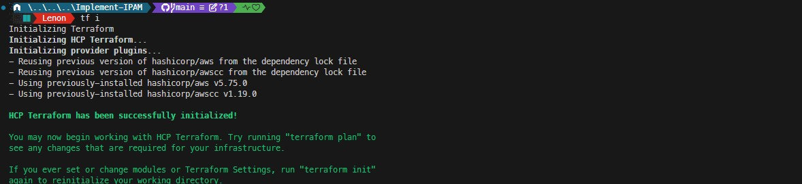


## Creating a VPC Using the AWS Provider

we’ll create a VPC in the `us-east-1` region using the `aws` provider. We’ll assign CIDR ranges to this VPC using the IPAM Pools we configured earlier. 

**This  demonstrates how to reference attributes from resources created with a different provider.**


- Create a VPC in `us-east-1` using the `aws` provider and set the CIDR range from the IPAM pool.

### Steps to Define the VPC Resource

1. **Define the VPC in `us-east-1`**: specify a netmask length of 24 and use the `ipv4_ipam_pool_id` attribute to link it to the IPAM pool we set up.

2. **Add the Resource Block**: Update `main.tf` with the following configuration:

   ```hcl
   resource "aws_vpc" "useast1" {
     ipv4_ipam_pool_id   = awscc_ec2_ipam_pool.useast1.id
     ipv4_netmask_length = 24

     tags = {
       Name = "us-east-1"
     }
   }

3. Apply the above changes `terraform apply`

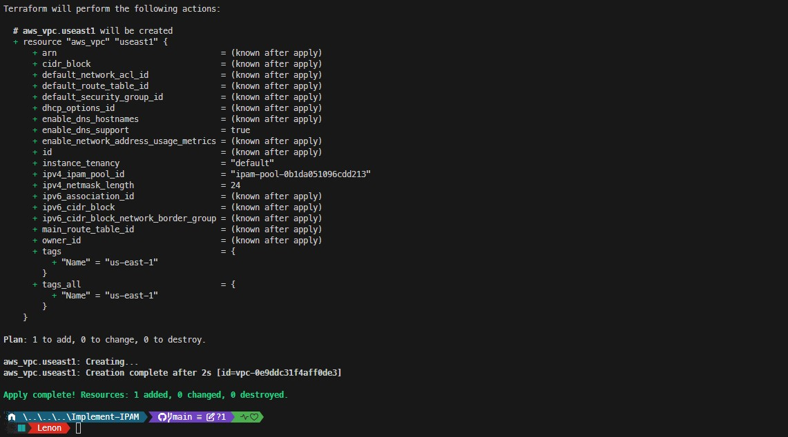

- check the [console](https://us-east-1.console.aws.amazon.com/vpc/home?region=us-east-1#vpcs:tag:Name=us-east-1)

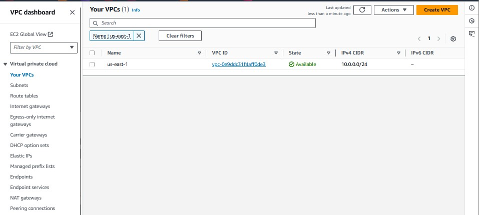


# Congratulations!

You have used the aws provider to create a VPC with attributes from resources created with the awscc provider


## Creating a VPC in Another Region Using the AWS Provider

we’ll create a VPC in the `us-east-2` region using the `aws` provider and assign CIDR ranges from the IPAM Pools we set up earlier. We’ll also explore provider aliasing to manage multiple regions effectively.


- Create a VPC in `us-east-2` using the `aws` provider and configure it with CIDR ranges from the IPAM pool.

### Step 1: Add Provider Configuration

1. **Open `providers.tf`** 
2. **Add the Following Provider Block**: Configure the `aws` provider for the `us-east-2` region using an alias.

   ```hcl
   provider "aws" {
     region = "us-east-2"
     alias  = "useast2"
   }


Initialize the newly defined provider `terraform init`. This  will download and install the aws provider for the us-east-2 region.

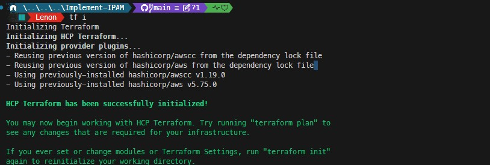


3. **Define the VPC Resource**
    - Open main.tf.
    - Add the Resource Block for the us-east-2 VPC: Use provider aliasing to deploy the VPC into the us-east-2 region.

    ```hcl
    resource "aws_vpc" "useast2" {
    provider = aws.useast2

    ipv4_ipam_pool_id   = awscc_ec2_ipam_pool.useast2.id
    ipv4_netmask_length = 24

    tags = {
        Name = "us-east-2"
    }
    }

**Note:** This resource uses the provider attribute with aliasing to ensure that the VPC is created in the us-east-2 region.


4. Create the VPC

- Apply the above changes `terraform apply`

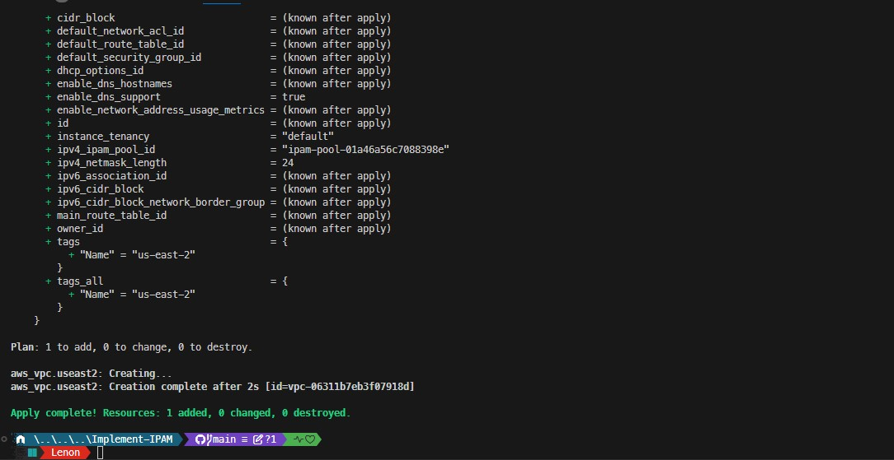

- Once the configuration is applied, head over to the AWS VPC [console](https://us-east-2.console.aws.amazon.com/vpc/home?region=us-east-2#vpcs:tag:Name=us-east-2) to verify that the VPC has been created in the us-east-2 region.

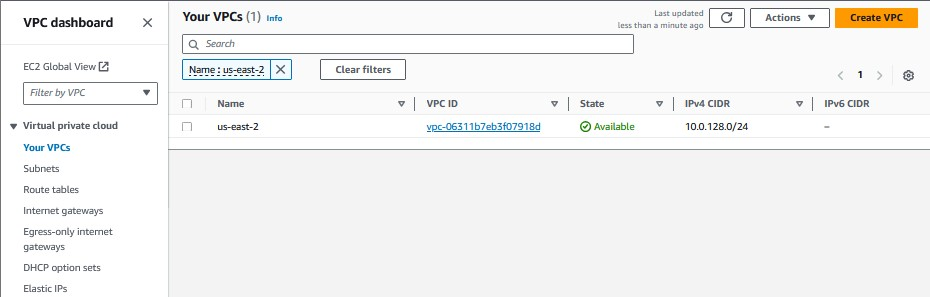

**Congratulations!** You’ve successfully used the aws provider to create a VPC in us-east-2, leveraging CIDR allocations from IPAM pools set up with the awscc provider.


## Shared Tags -  Provider Differences

When it comes to defining tags, the `aws` and `awscc` providers have different interfaces:

- **`awscc` Provider**: Uses the `tags` argument as a list of attribute objects for tag specifications.
- **`aws` Provider**: Uses the `tags` argument as a map of key-value pairs to apply to the resource.

### Example Tag Definitions

```bash
# awscc tag definition
tags = [{
  key   = "Name"
  value = "global-ipam"
}]

# aws tag definition
tags = {
  Name = "us-east-1"
}
```


## IPAM Resource Deletion Safety Mechanism

IPAM resources that manage VPCs include a built-in safety feature to prevent accidental deletion of CIDR ranges. This safety mechanism prevents immediate deletion of IPAM resources, even after an associated VPC has been removed.

### Bypassing the Safety Mechanism

To bypass this feature, we can use the `delete-ipam` CLI command with the `--cascade` flag. 
This allows for a quick, comprehensive deletion of an IPAM resource, including its private scopes, pools within those scopes, and any CIDR allocations within those pools.

Retrieve the IPAM ID from the [IPAM console](https://us-east-1.console.aws.amazon.com/ipam/home?region=us-east-1#IPAMs) 

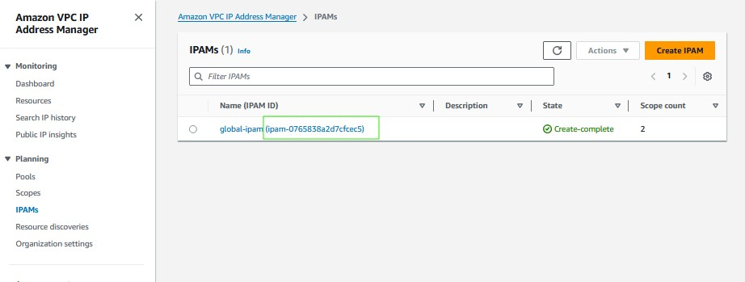


```bash
aws ec2 delete-ipam --ipam-id <ipam-id> --cascade
```
Mine will be - 

```
aws ec2 delete-ipam --ipam-id "ipam-0765838a2d7cfcec5" --cascade**
```

**Note**: Use the --cascade flag carefully, as it will remove all associated resources within the specified IPAM.

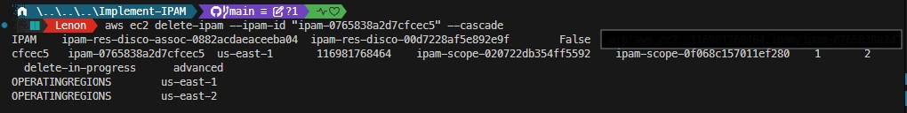


## Deleting IPAM Resources

After deleting the IPAM, it’s important to wait approximately 5 minutes before proceeding to destroy the remaining Terraform-managed resources. This waiting period ensures that all dependencies are fully cleared.

### Destroying the Remaining Resources

We’ll now use the Terraform CLI to remove all other resources. Run the following command in the Cloud9 terminal to complete the cleanup:

```bash
terraform destroy --auto-approve
```

**Note**: The --auto-approve flag skips the confirmation prompt, so use it with caution to avoid accidental deletions.

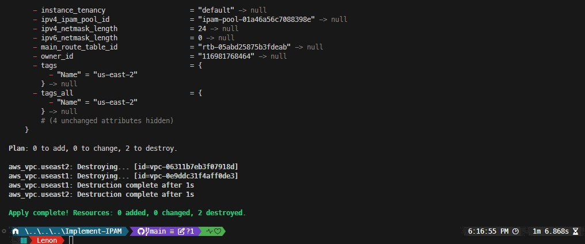

## Conclusion

In this workshop, we successfully created AWS cloud resources using Terraform, applying Infrastructure as Code (IaC) best practices and gaining hands-on experience with IP Address Management (IPAM).

Here’s what we covered:

- How to use Terraform to create AWS resources in a declarative manner
- Working with multiple Terraform providers and referencing resources across providers
- Creating and managing resources in multiple AWS regions with Terraform
- An introduction to Amazon VPC IP Address Manager (IPAM) for organizing and managing IP address allocations


____

